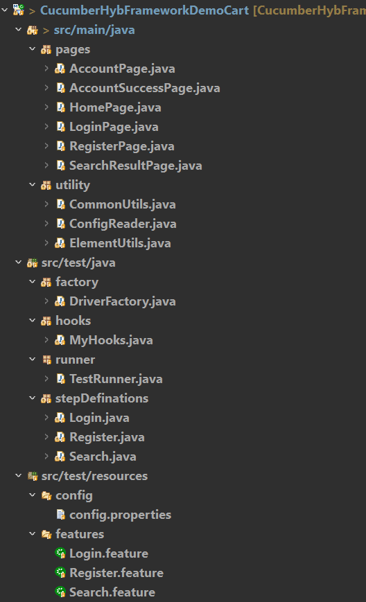

# QA Automation Framework Showcase 🚀

This repository is a **portfolio showcase** of a Cucumber Hybrid Framework I built for UI testing.  
It demonstrates my ability to design **scalable, maintainable test automation** using Java, Selenium, and Cucumber.

## 📂 Project Structure

- **pages/** → Page Object classes that represent UI pages and elements.  
- **utility/** → Helper classes for common functionality (e.g., config reader, element utils).  
- **factory/** → DriverFactory handles WebDriver initialization and setup.  
- **hooks/** → Contains `MyHooks.java` for Cucumber `@Before` and `@After` hooks.  
- **runner/** → Entry point for running Cucumber tests (`TestRunner.java`).  
- **stepDefinitions/** → Glue code that connects feature steps to Java methods.  
- **features/** → Cucumber feature files written in Gherkin syntax.  
- **config/** → Configuration file (`config.properties`) for test environment settings.  
- **pom.xml** → Maven dependencies (Selenium, Cucumber, JUnit Cucumber Reports, etc.).  

---

## 🔹 Tech Stack
- Java  
- Selenium WebDriver  
- Cucumber (BDD)  
- JUnit 
- Maven    
- Cucumber JUnit Reports  

---

## 🔹 Features
- **Hybrid Design** → Combines Data-Driven + BDD approaches  
- **Page Object Model (POM)** → Reusable and maintainable test structure  
- **Reporting** → Integrated with Cucumber JUnit Reports for execution visibility  
 

---

## 🔹 Example Scenarios
- **Login.feature** → Login with valid/invalid credentials  
- **Register.feature** → Register workflow  
- **Search.feature** → Product search workflow  

*(Note: Real project code, data, and business logic are excluded for confidentiality. This repo contains only sample code and structure for demonstration.)*

---

## 🔹 Screenshots
### Cucumber HTML Report

### Jenkins Pipeline

### Cucmber Cloud Report Link

---

## 🔹 Why This Repo?
This is **not a full production codebase**, but a **showcase** of:
- Framework design skills  
- Best practices in test automation  

👉 For a full walkthrough, feel free to connect with me on [LinkedIn](www.linkedin.com/in/indrajit-poddar-68a0b1372).
