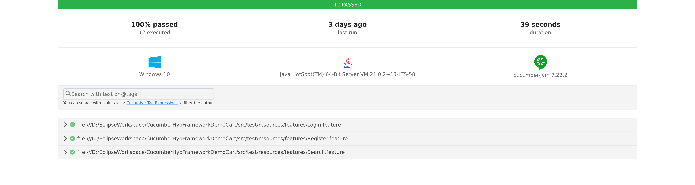

# QA Automation Framework Showcase 🚀

This repository is a **portfolio showcase** of a Cucumber Hybrid Framework I built for UI testing.  
It demonstrates my ability to design **scalable, maintainable test automation** using Java, Selenium, and Cucumber.

---

## 🔹 Tech Stack
- Java  
- Selenium WebDriver  
- Cucumber (BDD)  
- TestNG  
- Maven  
- Jenkins (CI/CD)  
- Extent Reports  

---

## 🔹 Features
- **Hybrid Design** → Combines Data-Driven + BDD approaches  
- **Page Object Model (POM)** → Reusable and maintainable test structure  
- **Reporting** → Integrated with Extent Reports for execution visibility  
- **CI/CD Ready** → Configured with Jenkins for automated test runs  

---

## 🔹 Example Scenarios
- **Login.feature** → Login with valid/invalid credentials  
- **Search.feature** → Product search workflow  

*(Note: Real project code, data, and business logic are excluded for confidentiality. This repo contains only sample code and structure for demonstration.)*

---

## 🔹 Screenshots
### Cucumber HTML Report

### Jenkins Pipeline

---

## 🔹 Why This Repo?
This is **not a full production codebase**, but a **showcase** of:
- Framework design skills  
- Best practices in test automation  
- CI/CD integration experience  

👉 For a full walkthrough, feel free to connect with me on [LinkedIn](https://www.linkedin.com/in/your-profile).
